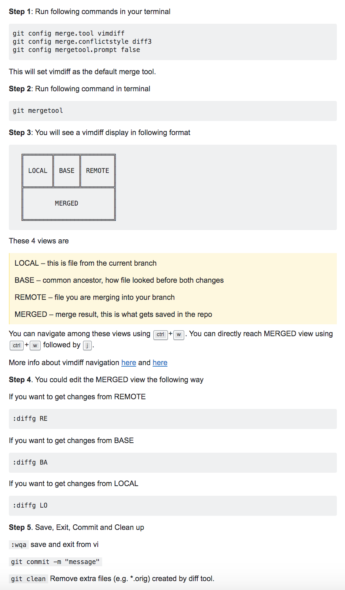

## Notes

## Merge Conflicts:
Info from [here](https://stackoverflow.com/a/163659/11440856)
```
git mergetool
git config merge.tool vimdiff (or use one of tkdiff, xxdiff, tortoisemerge, gvimdiff, diffuse)
git config merge.conflictstyle diff3
git config mergetool.prompt false
git mergetool
```


## Remotes
### List Remotes:
```
git remote -v
```

### View Info About a Remote:
```
git remote show XXX ex: git remote show origin  - Shows all the branches on the remote, including those that are not tracked locally and even those that have not yet been fetched.
```

## Rollbacks in GitOps Model:
```
git reset
```
## Rollout in GitOps Model:
```
git commit
```

## Branch Types
1. Remote branch tracked locally - git branch -r
2. Local branch not tracking any remote - git branch
3. Remote branch not in local - git fetch --all && git branch -r

### Create Local Branches tracking the Remotes.
```
for remote in `git branch -r`; do git branch --track ${remote#origin/} $remote; done
```

### General fetch
```
git fetch --all
* fetch updates local copies of remote branches so this is always safe for your local branches BUT:
* fetch will not update local branches (which track remote branches); if you want to update your local branches you still need to pull every branch.
* fetch will not create local branches (which track remote branches), you have to do this manually.
```

### To update local branches which track remote branches:
```
git pull --all
```

### Setup Local branch tracking a remote
```
$ git checkout -b release origin/release
Branch 'release' set up to track remote branch 'release' from 'origin'.
Switched to a new branch 'release'
```

## Checkout Related

### Checkout by commit hash
```
git checkout <commit_sha>
git checkout -b <new_branch> <commit_sha>
```
### Checkout by tag
```
git fetch && git fetch --tags && git checkout v1.19
```

## General Notes
| Compare branches - Shows a brief overview of all the commits that are in some-feature that are not in master. | git log --oneline master..some-feature |
| Show git config | git config --list |
| Delete remote branch | git push origin --delete BRANCH_NAME |
| Delete local branch | git branch -d branch_name |
| Git unset or change password | git config --global --unset user.password |
| Rebase local branch - rebase option to avoid a superfluous “merge commit” | git pull --rebase |
| Show remote origin | git remote show origin |
| Set remote URL | git remote set-url origin https://USER@github.com/scm/project/project.git and cat ./config and git remote -v|
| Set git user name | git config --global user.name "USER.NAME" |
| Set git user mail | git config --global user.email "USER.MAIL" |
| Create new local branch and push to remote | git checkout -b BRANCH_NAME and git push -u origin BRANCH_NAME |
| List all *new or modified* files | git status |
| Show file differences that **haven't been** staged | git diff |
| To unstage a file which was staged for commit | git reset HEAD somewhere/somefile.someextension - File goes back to being not staged for commit|
| Show files in a commit | git show --pretty="" --name-only c1035fdddc1d7eb4486c2ac9733fc15943362cce |
| Git check ignore | git check-ignore * |
