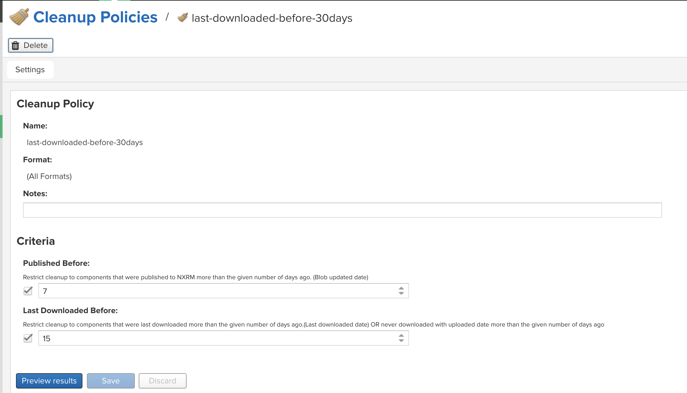
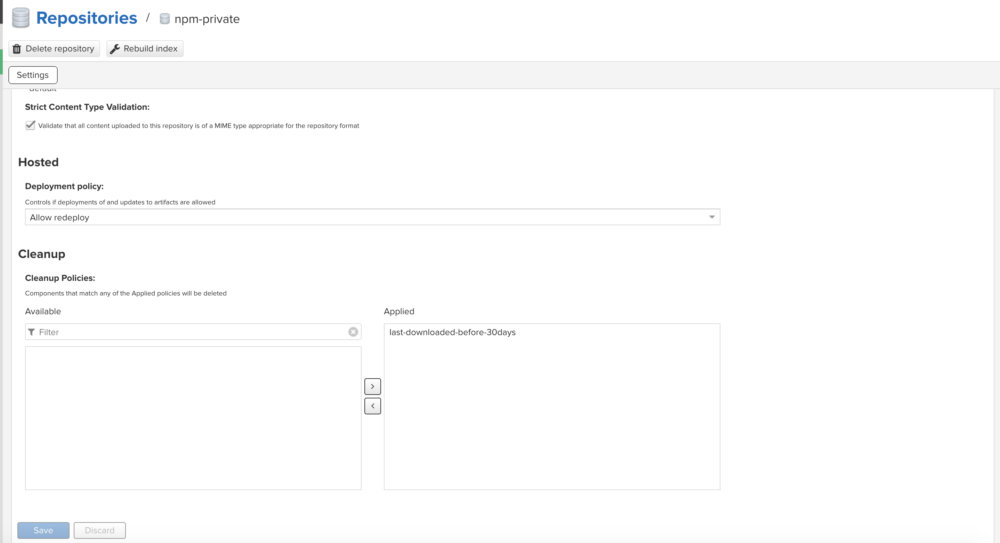
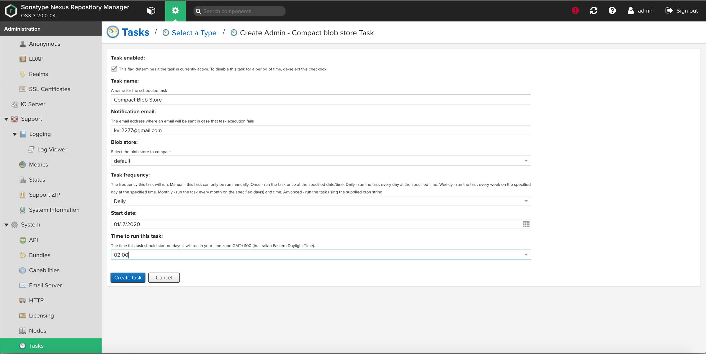

## Clean-Up Policies:
1. Define Clean-Up Policy
2. Attach the Clean-Up policy to a Repository





## Nexus Blob Compaction
```
Before Blob Compaction Run

[root@ip-172-xx-xx-xx nexus-data]# du -sh *
11G	blobs
26M	cache
221M	db
3.5M	elasticsearch
12K	etc
4.0K	generated-bundles
8.0K	instances
68K	javaprefs
4.0K	kar
4.0K	karaf.pid
20K	keystores
4.0K	lock
12M	log
4.0K	orient
4.0K	port
4.0K	restore-from-backup
15M	tmp
4.0K	upgrades
[root@ip-172-xx-xx-xx nexus-data]#

Kick off the Blob Compaction - Logs on Server

2020-01-17 04:02:56,528+0000 INFO  [qtp1267977758-49] admin org.sonatype.nexus.quartz.internal.task.QuartzTaskInfo - Task 'Compact Blob Store' [blobstore.compact] : state=WAITING
2020-01-17 04:02:56,536+0000 INFO  [qtp1267977758-49] admin org.sonatype.nexus.scheduling.TaskSchedulerImpl - Task 'Compact Blob Store' [blobstore.compact] scheduled: daily
2020-01-17 04:03:16,387+0000 INFO  [qtp1267977758-45] admin org.sonatype.nexus.quartz.internal.task.QuartzTaskInfo - Task 'Compact Blob Store' [blobstore.compact] runNow
2020-01-17 04:03:16,388+0000 INFO  [qtp1267977758-45] admin org.sonatype.nexus.quartz.internal.task.QuartzTaskInfo - Task 'Compact Blob Store' [blobstore.compact] state change WAITING -> RUNNING
2020-01-17 04:03:16,412+0000 INFO  [quartz-3-thread-8] *SYSTEM org.sonatype.nexus.blobstore.compact.internal.CompactBlobStoreTask - Task log: /nexus-data/log/tasks/blobstore.compact-20200117040316410.log
2020-01-17 04:03:16,413+0000 INFO  [quartz-3-thread-8] *SYSTEM org.sonatype.nexus.blobstore.file.FileBlobStore - Deletions index file rebuild not required
2020-01-17 04:03:16,417+0000 INFO  [quartz-3-thread-8] *SYSTEM org.sonatype.nexus.blobstore.file.FileBlobStore - Begin deleted blobs processing
2020-01-17 04:07:04,267+0000 INFO  [quartz-3-thread-8] *SYSTEM org.sonatype.nexus.blobstore.file.FileBlobStore - ---- Elapsed time: 3.797 min, processed: 111327/111327 ----
2020-01-17 04:07:04,274+0000 INFO  [quartz-3-thread-8] *SYSTEM org.sonatype.nexus.quartz.internal.task.QuartzTaskInfo - Task 'Compact Blob Store' [blobstore.compact] state change RUNNING -> WAITING (OK)

After Blob Compaction

[root@ip-172-xx-xx-xx nexus-data]# du -sh *
674M	blobs
26M	cache
221M	db
3.5M	elasticsearch
12K	etc
4.0K	generated-bundles
8.0K	instances
68K	javaprefs
4.0K	kar
4.0K	karaf.pid
20K	keystores
4.0K	lock
12M	log
4.0K	orient
4.0K	port
4.0K	restore-from-backup
15M	tmp
4.0K	upgrades
[root@ip-172-xx-xx-xx nexus-data]#
```


